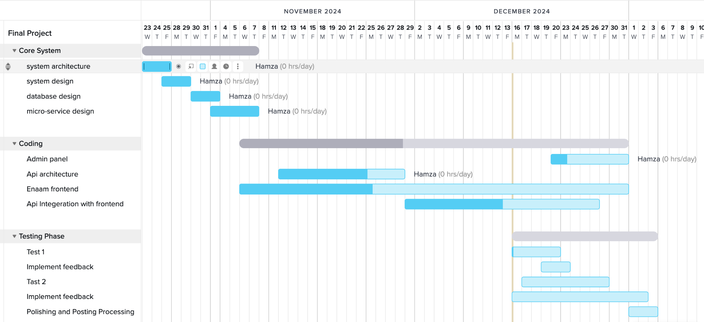
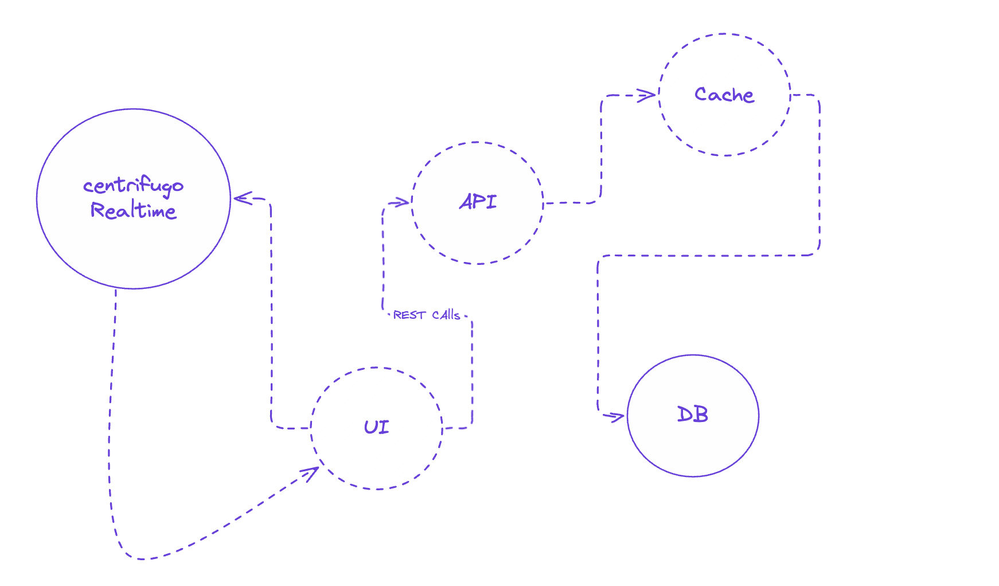
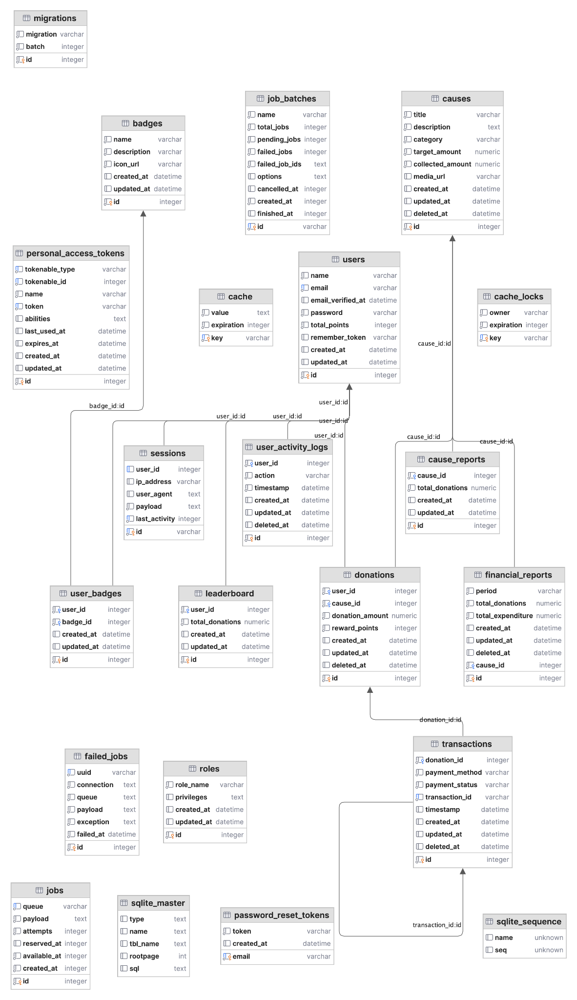
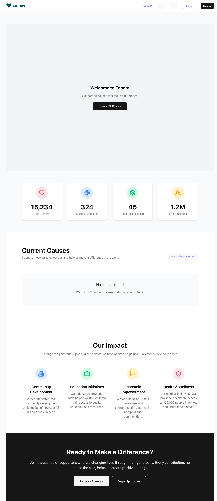
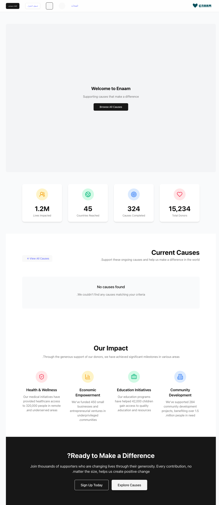
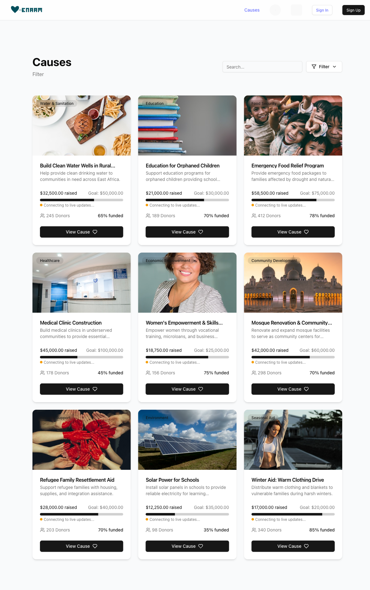
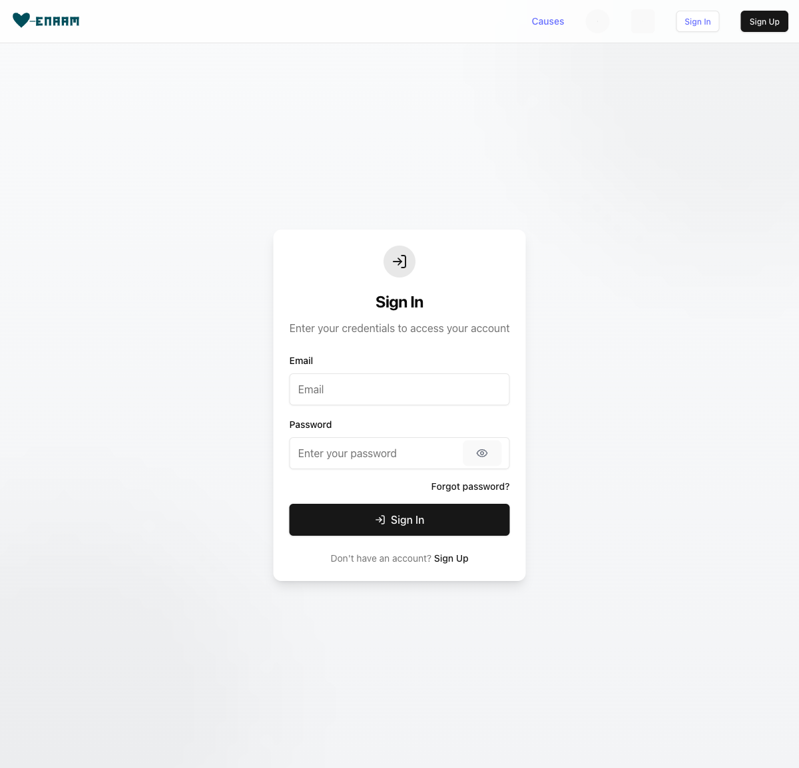
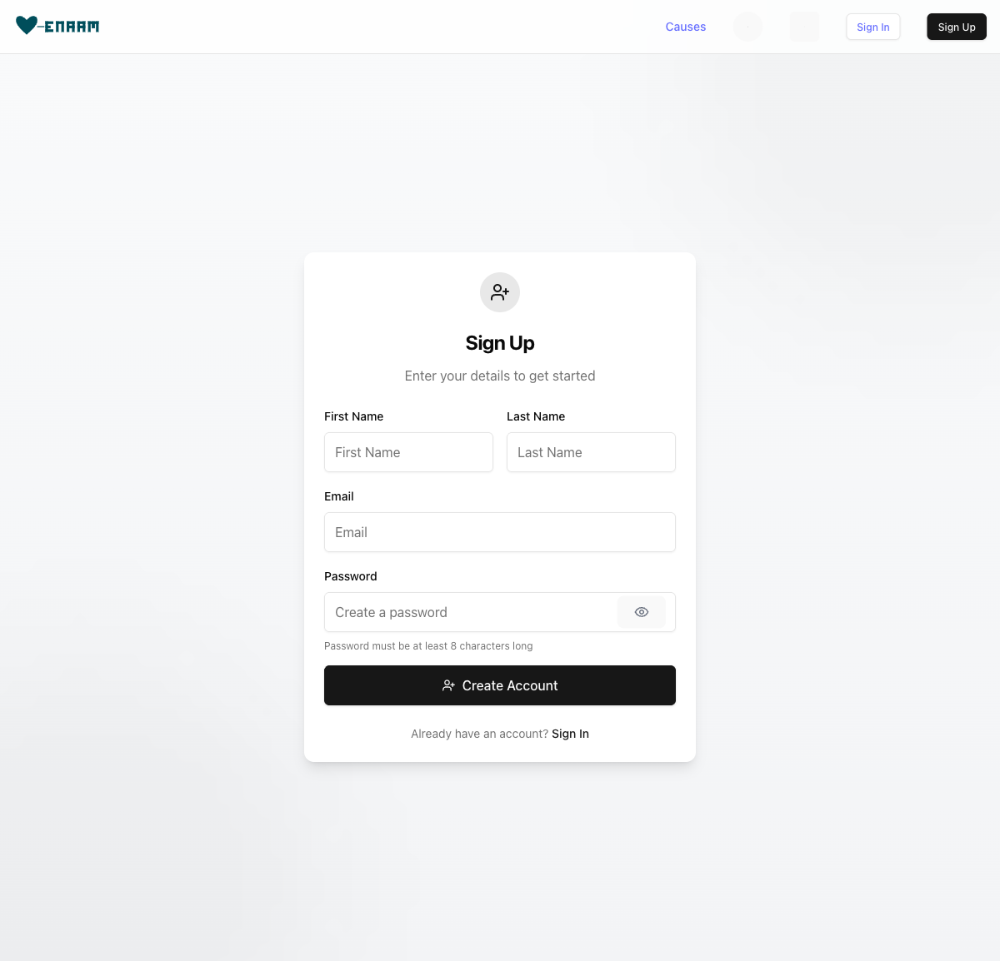
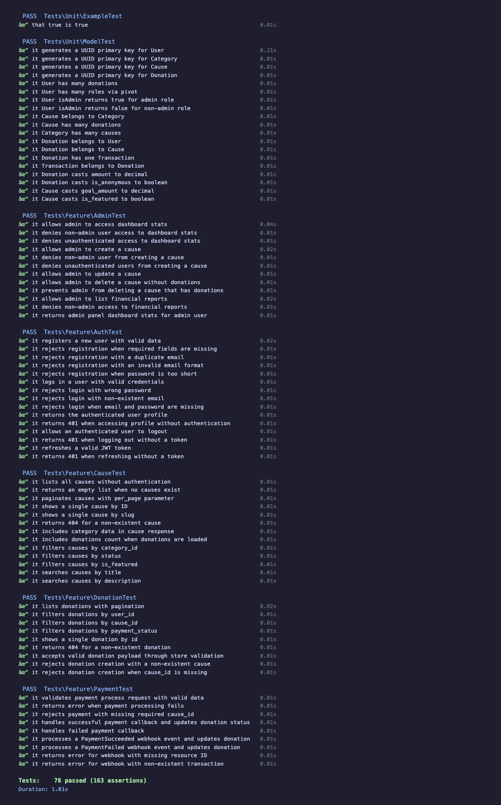

<div style="display: flex; flex-direction: column; align-items: center; justify-content: center; min-height: 85vh; text-align: center; page-break-after: always;">
  <div style="margin-top: 100px;">
    <h1 style="font-size: 24px; font-weight: bold; line-height: 1.5; max-width: 600px; margin: 0 auto;">Enaam: A Full-Stack Charitable Donation Platform with Real-Time Transparency, Bilingual Support, and Gamification</h1>
  </div>
  <div style="margin-top: 50px;">
    <p style="font-size: 18px; color: #444;">CM3070 Final Project</p>
  </div>
  <div style="margin-top: 60px;">
    <p style="font-size: 16px;">BSc Computer Science</p>
    <p style="font-size: 16px; margin-top: 8px;">University of London</p>
  </div>
  <div style="margin-top: 60px;">
    <p style="font-size: 16px; font-weight: bold;">Hamza Zymawy</p>
  </div>
  <div style="margin-top: 40px;">
    <p style="font-size: 14px; color: #666;">February 2026</p>
  </div>
</div>

# Table of Contents

- **Abstract**
- **Chapter 1: Introduction**
  - 1.1 Project Overview
  - 1.2 Motivation
  - 1.3 Research Objectives
  - 1.4 Project Scope
- **Chapter 2: Literature Review**
  - 2.1 The Intersection of Technology and Charitable Giving
  - 2.2 Transparency as a Driver of Donor Trust
  - 2.3 User Experience Design in Non-Profit Platforms
  - 2.4 Comparative Analysis of Existing Platforms
  - 2.5 Modular Architecture in Web Applications
  - 2.6 Gamification and Behavioural Design
  - 2.7 Localisation and Accessibility
  - 2.8 Summary of Gaps in Literature and Practice
- **Chapter 3: System Design and Architecture**
  - 3.1 System Overview
  - 3.2 Database Design
  - 3.3 API Design
  - 3.4 Authentication and Authorisation Design
  - 3.5 Payment Flow Design
  - 3.6 Real-Time Architecture
  - 3.7 Docker Compose Infrastructure
  - 3.8 Internationalisation Design
- **Chapter 4: Implementation**
  - 4.1 Technology Stack
  - 4.2 Backend Implementation
  - 4.3 Frontend Implementation
  - 4.4 Admin Panel Implementation
  - 4.5 Testing Implementation
  - 4.6 Security Implementation
  - 4.7 Docker Compose Deployment
  - 4.8 Summary
- **Chapter 5: Evaluation**
  - 5.1 Evaluation Methodology
  - 5.2 Automated Test Results
  - 5.3 Security Assessment
  - 5.4 Bugs Discovered and Resolved
  - 5.5 Functional Evaluation
  - 5.6 Limitations
  - 5.7 Comparison with Research Objectives
- **Chapter 6: Conclusion**
  - 6.1 Summary of Achievements
  - 6.2 Critical Reflection
  - 6.3 Personal Learning
  - 6.4 Future Work
  - 6.5 Concluding Statement
- **References**

<div style="page-break-after: always;"></div>

# Abstract

This report presents the design, implementation, and evaluation of Enaam, a full-stack charitable donation platform addressing persistent deficiencies in transparency, accessibility, and donor engagement within the online philanthropic giving landscape, with particular emphasis on the Middle East and North Africa (MENA) region. The platform comprises a React 18 donor-facing single-page application, a Laravel 12 RESTful API, and a Vue 3 administrative dashboard, orchestrated through Docker Compose. Key technical contributions include real-time donation progress tracking via a Centrifugo WebSocket server, secure payment processing through the MyFatoorah gateway with HMAC-SHA256 webhook verification, comprehensive bilingual support for English and Arabic with full right-to-left layout adaptation, and a gamification layer incorporating badges and achievement milestones. The system was evaluated through a suite of 78 automated tests (163 assertions, 100% pass rate), a heuristic security assessment aligned with the OWASP Top Ten framework, and manual functional evaluation of key user journeys in both supported languages. Testing identified and resolved three critical bugs prior to evaluation, validating the automated testing strategy. All five research objectives were achieved. The report critically examines the platform's limitations, including the absence of frontend tests, load testing, and production deployment configuration, and proposes concrete directions for future development.

<div style="page-break-after: always;"></div>

# Chapter 1: Introduction

## 1.1 Project Overview

Enaam is a full-stack web-based charitable donation platform designed to address deficiencies in transparency, accessibility, and donor engagement within online philanthropic giving, with particular emphasis on the Middle East and North Africa (MENA) region. The platform name, derived from the Arabic word meaning "blessings," reflects its core objective: facilitating trustworthy and culturally appropriate digital charitable giving.

The contemporary charitable giving ecosystem is characterised by a significant trust deficit. Donors encounter opaque reporting mechanisms, limited visibility into fund allocation, and insufficient feedback on campaign progress. These shortcomings are compounded in the MENA region by a scarcity of platforms offering comprehensive Arabic language support, right-to-left (RTL) layout adaptation, and integration with regionally prevalent payment infrastructure.

Enaam addresses these challenges through three principal components: a donor-facing single-page application (SPA) built with React 18 and TypeScript, an administrative dashboard constructed with Vue 3, and a RESTful API implemented in Laravel 12. The system is orchestrated through Docker Compose, with real-time campaign updates delivered via a Centrifugo WebSocket server. The platform further incorporates bilingual English/Arabic support with full RTL adaptation, secure payment processing through the MyFatoorah gateway, and a gamification layer of badges and achievement milestones.

## 1.2 Motivation

Global online giving increased by approximately 21% between 2019 and 2021 (Charities Aid Foundation, 2022), yet this growth has introduced concerns regarding transparency, accountability, and equitable treatment of diverse donor populations. Prominent platforms such as GoFundMe offer broad reach but limited post-donation transparency and no real-time tracking. GlobalGiving provides accountability mechanisms but remains oriented towards English-speaking Western markets. Within the MENA region, Ehsan.sa offers government-backed verification and Arabic support but lacks gamification features, real-time feedback mechanisms, and availability to non-Saudi organisations.

A critical gap exists across these platforms: the absence of a unified solution simultaneously addressing transparency through real-time progress tracking, cultural accessibility through comprehensive bilingual and RTL support, and sustained engagement through gamification. This gap is particularly acute for Arabic-speaking donors, who represent a philanthropically active demographic—charitable giving constitutes one of the five pillars of Islam, and the MENA region consistently ranks among the most generous globally in per-capita contributions (World Giving Index, 2022)—yet are poorly served by predominantly English-language digital giving infrastructure.

The scale of the trust problem is significant. Research consistently indicates that perceived lack of accountability is among the primary reasons potential donors withhold contributions, with surveys suggesting that over 30% of individuals who considered donating online ultimately did not proceed due to concerns about how their funds would be used (Charities Aid Foundation, 2022). In the MENA region, where personal trust relationships traditionally mediate charitable giving, the transition to digital platforms demands even higher standards of transparency and cultural sensitivity. The motivation for this project arose from direct observation of these deficiencies: recurring patterns of donor hesitation attributable to insufficient transparency, frustration with inadequate Arabic language support, and disengagement resulting from impersonal donation workflows.

## 1.3 Research Objectives

Five research objectives guide the design, implementation, and evaluation of Enaam:

**RO1: Design and implement a transparent donation platform with real-time progress tracking.** This addresses the trust deficit through real-time campaign progress indicators and donation activity feeds, leveraging a Centrifugo WebSocket server for instantaneous updates.

**RO2: Integrate a secure payment gateway supporting multiple MENA-region payment methods.** The platform integrates MyFatoorah, supporting Visa, Mastercard, KNET, Apple Pay, and regional bank transfers, with secure webhook-based transaction verification.

**RO3: Implement bilingual support for English and Arabic with full RTL layout adaptation.** The donor-facing application employs react-i18next with dynamic layout direction switching, culturally appropriate formatting, and comprehensive translation coverage.

**RO4: Develop role-based access control with separate donor and administrative interfaces.** The donor SPA and Vue 3 admin dashboard serve distinct user roles, with JWT-based authentication and role-specific permission scoping.

**RO5: Create a comprehensive automated test suite to validate platform reliability.** The test suite encompasses unit and integration tests covering authentication, donation processing, payment verification, and role-based access control.

## 1.4 Project Scope

**Inclusions:**
- Donor-facing React 18 SPA with campaign browsing, donations, and real-time tracking
- Vue 3 administrative dashboard for campaign and user management
- Laravel 12 RESTful API with JWT authentication
- Centrifugo WebSocket server for real-time updates
- MyFatoorah payment gateway integration
- Badge and achievement gamification system
- Full English/Arabic bilingual support with RTL layout
- Docker Compose containerised deployment

**Exclusions:**
- Native mobile applications (responsive web only)
- Blockchain-based auditing (transparency via real-time tracking instead)
- Multi-currency conversion
- Production deployment configuration



<div style="page-break-after: always;"></div>

# Chapter 2: Literature Review

This chapter surveys the academic and practitioner literature relevant to the design and evaluation of the Enaam charitable donation platform. The review is organised thematically, progressing from the broader landscape of technology-mediated philanthropy to the specific technical and behavioural design decisions that inform the platform's architecture.

## 2.1 The Intersection of Technology and Charitable Giving

Bekkers and Wiepking (2011) analysed over 500 empirical studies and identified eight principal drivers of charitable giving: awareness of need, solicitation, costs and benefits, altruism, reputation, psychological benefits, values, and efficacy. Several of these mechanisms have direct implications for platform design. Awareness of need suggests that presenting real-time campaign progress increases donation likelihood. Costs and benefits highlights the importance of minimising transactional friction. Reputation underscores the value of public recognition features and social proof. Efficacy—the belief that one's contribution makes a tangible difference—demands transparency mechanisms that allow donors to trace their impact.

Despite the operationalisation of these mechanisms by crowdfunding platforms such as GoFundMe and GlobalGiving, most existing platforms address only a subset of the eight drivers. Enaam is designed with explicit attention to all eight: real-time tracking addresses awareness and efficacy; streamlined payment minimises costs; badges and leaderboards engage reputation and psychological benefits; bilingual content connects with values; and notifications operationalise solicitation.

## 2.2 Transparency as a Driver of Donor Trust

Saxton and Guo (2011) identified two dimensions of online accountability—disclosure and dialogue—finding that nonprofits were more effective at providing disclosure than creating dialogic engagement. This asymmetry suggests that platforms combining financial reporting with real-time interactive communication may achieve higher donor trust.

Dethier, Delcourt, and Dessart (2024) advanced this conceptualisation with a three-dimensional model of nonprofit transparency: information accessibility, completeness, and accuracy. Their validated instrument demonstrated that donors evaluate these dimensions independently when forming trust judgements.

Enaam addresses all three dimensions. Accessibility is served by dashboards surfacing campaign progress in both Arabic and English. Completeness is achieved through integration of payment confirmations, administrative reports, and campaign statistics. Accuracy is supported by real-time data delivery via the Centrifugo WebSocket server, ensuring donation totals reflect the current system state without polling delays. This continuous, push-based transparency represents a departure from the periodic reporting documented in prior literature.

## 2.3 User Experience Design in Non-Profit Platforms

The Nielsen Norman Group's hierarchy of trust identifies five experiential levels of website commitment, from initial visual assessment to sustained engagement (Laubheimer, 2019). At the foundational level, users assess trustworthiness within seconds based on visual design quality and familiar trust indicators. At higher levels, trust depends on interaction reliability and promise fulfilment. This implies that charitable platforms must invest in visual and interactive qualities that establish credibility before users reach the donation form.

Krug (2014) argued that web design should eliminate unnecessary cognitive effort, with particular relevance for charitable platforms where donors span a wide range of technical proficiency. Enaam applies these principles through a minimal-step donation flow, a consistent component library (shadcn/ui), clear visual hierarchy, and prominent progress indicators. Real-time donation notifications via Centrifugo provide social proof, while progress bars convey momentum, drawing on the broader emotional design literature (Norman, 2013).

## 2.4 Comparative Analysis of Existing Platforms

**Table 2.1: Comparative Feature Analysis of Charitable Donation Platforms**

| Feature | GoFundMe | GlobalGiving | Ehsan.sa | Enaam |
|---|---|---|---|---|
| Real-time donation tracking | No | No | Limited | Yes (Centrifugo WebSocket) |
| Bilingual support | No | Limited | Arabic only | Full EN + AR with RTL |
| Regional payment gateway | Stripe (Western) | Multiple | Local Saudi | MyFatoorah (MENA) |
| Transparency tools | Basic updates | Periodic reports | Government-audited | Real-time + financial reports |
| Gamification features | No | Badges (orgs) | No | Badges, achievements, leaderboard |
| Open-source codebase | No | No | No | Yes |
| WebSocket integration | No | No | No | Yes (Centrifugo) |

GoFundMe offers broad reach but no real-time tracking, limited transparency, and Western-centric payment infrastructure. GlobalGiving provides accountability through periodic impact reports but lacks a bilingual RTL interface and real-time updates. Ehsan.sa benefits from government-backed trust within Saudi Arabia but is limited to Saudi-registered organisations, lacks gamification, and does not offer real-time WebSocket tracking. Enaam addresses the limitations identified across all three platforms by combining real-time transparency, full bilingual RTL support, regional payment processing, gamification, and an open-source codebase.

## 2.5 Modular Architecture in Web Applications

Newman (2015) argued that decomposing systems into independently deployable services enables features to evolve at different rates. Enaam does not implement microservices in the strict sense; the backend is a Laravel monolith. However, the project adopts modular principles: the React frontend communicates with the backend exclusively via REST API; the Vue admin panel operates as a separate SPA; and Centrifugo runs as an independent WebSocket service. Docker Compose provides container-level isolation, offering deployment benefits of service separation without the operational complexity of a fully distributed system. This modular monolith approach reflects a pragmatic assessment of the project's scale.

## 2.6 Gamification and Behavioural Design

Deterding et al. (2011) defined gamification as the application of game design elements in non-game contexts, distinguishing it from serious games and full game design. This definition clarifies Enaam's approach: the platform applies specific game elements (badges, leaderboards, progress indicators) rather than constructing a game. Fogg (2003) posited that behaviour occurs at the intersection of motivation, ability, and triggers. For donation platforms, this framework implies that narrative and emotional design support motivation, streamlined payment addresses ability, and real-time notifications provide triggers. Schell (2019) extended this perspective by arguing that effective game design requires balancing mechanics, aesthetics, narrative, and technology—a lens applicable to donation platform design where each element must reinforce donor engagement. A systematic literature review by Hamari, Koivisto, and Sarsa (2014) examining 24 empirical studies found that gamification produces positive effects in the majority of cases, though outcomes depend heavily on the context in which gamification is implemented and the quality of the user experience surrounding the game elements. Golrang and Safari (2021) demonstrated empirically that gamification elements—particularly points, badges, and leaderboards—significantly increased engagement and repeated donation behaviour on crowdfunding platforms, providing direct evidence for the applicability of gamification within the charitable giving domain.

Enaam implements a multi-layered gamification strategy. Badges reward milestones such as first donation and cumulative thresholds. Progress indicators leverage the goal-gradient effect. Leaderboards introduce social reputation dynamics (Bekkers and Wiepking, 2011). Real-time notifications serve as social proof and solicitation triggers. These features operate in concert to sustain donor participation beyond the initial act of giving.

## 2.7 Localisation and Accessibility

The W3C provides comprehensive internationalisation guidelines for RTL scripts (W3C, 2022), specifying that web applications must set the `dir` attribute at the document level, use CSS logical properties (`margin-inline-start` rather than `margin-left`) to ensure layout adaptation, and handle bidirectional text isolation for mixed-script content using the Unicode Bidirectional Algorithm. RTL support requires document directionality attributes, logical CSS properties, and layout mirroring. Bidirectional text handling is particularly complex when Arabic and English coexist within the same interface, as inline directional changes can produce unexpected reordering of punctuation, numbers, and mixed-language strings. Beyond structural concerns, cultural localisation demands adaptation of date formats, number representations, currency symbols, and progress indicator direction.

Enaam implements full RTL support using CSS logical properties and conditional layout mirroring. The interface is designed with both languages from the outset. Accessibility extends to WCAG 2.1 AA compliance through semantic HTML, keyboard navigability, sufficient colour contrast, and screen reader compatibility via shadcn/ui components.

## 2.8 Summary of Gaps in Literature and Practice

**Table 2.2: Gap Analysis Across Literature, Practice, and Enaam**

| Domain | Literature Identifies | Existing Platforms Provide | Enaam Addresses |
|---|---|---|---|
| Donor motivation | Eight mechanisms (Bekkers and Wiepking, 2011) | Partial coverage (2-3 mechanisms) | All eight mechanisms |
| Transparency | Disclosure + dialogue; Accessibility, completeness, accuracy | Periodic retrospective reports | Real-time WebSocket transparency |
| Gamification | MDA framework (Hunicke, LeBlanc and Zubek, 2004); Persuasive technology | Minimal or absent | Badges, leaderboards, progress, real-time feedback |
| Architecture | Modular, service-oriented design | Proprietary, non-modular | Open-source, containerised, modular monolith |
| Localisation | W3C RTL and i18n guidelines | English-centric or single-language | Full bilingual EN/AR with RTL |

The central gap that Enaam addresses is the absence of a platform simultaneously providing real-time transparency, comprehensive gamification, full bilingual RTL support, regional payment integration, and an open-source codebase. The literature tends to address these dimensions in isolation; Enaam's design is informed by the proposition that they are interdependent: transparency builds trust, gamification sustains engagement, and well-designed user experience ensures both are accessible to all potential donors.

<div style="page-break-after: always;"></div>

# Chapter 3: System Design and Architecture

## 3.1 System Overview

The Enaam charitable donation platform employs a **service-oriented monorepo** architecture organised within a single repository. It is important to state at the outset what this architecture is not: it is not a microservices architecture. All three applications share a single PostgreSQL database, are orchestrated through a unified Docker Compose configuration, and communicate via standard REST APIs rather than through message queues or service meshes. A single database instance eliminates the need for distributed transaction coordination, data consistency protocols, or inter-service communication patterns such as sagas. This design choice is appropriate for the project's scale and reduces operational complexity while retaining a clean separation of concerns at the application level.

The system comprises three principal applications:

1. **Donor-Facing Single-Page Application (SPA)**: A React 18 application written in TypeScript, built with Vite, and styled using shadcn/ui (which composes Radix UI primitives with Tailwind CSS). This application serves as the primary interface through which donors browse charitable causes, make donations, track their contribution history, and earn achievements.

2. **REST API Server**: A Laravel 12 application running on PHP 8.2, serving as the authoritative backend for all business logic, data persistence, authentication, payment processing, and real-time event broadcasting. The API layer is built on the Dingo API package, which provides versioned routing under the `/api/v1/` namespace, and uses Fractal Transformers (via the `laravel-responder` package) to format all outbound responses consistently.

3. **Administrative Dashboard**: A Vue 3 application written in TypeScript, using Pinia for state management, Headless UI for accessible component primitives, Tailwind CSS for styling, and Chart.js for data visualisation. This dashboard enables administrators to manage causes, categories, partners, users, donations, financial reports, and platform-wide analytics.

The React SPA and Vue admin panel each maintain their own HTTP client that issues requests to the versioned API endpoints. There is no direct communication between the two frontend applications; all data flows through the centralised backend. Supporting infrastructure services are co-located in the Docker Compose environment: PostgreSQL (primary database), Redis (caching and session storage), Elasticsearch (full-text search indexing), Centrifugo (WebSocket server for real-time donation updates), Adminer (database management interface), and Mailhog (email testing).

### System Architecture Diagram




## 3.2 Database Design

### 3.2.1 Primary Key Strategy

All domain models use Universally Unique Identifiers (UUIDs) as primary keys, implemented through Laravel's `HasUuids` trait. UUIDs prevent enumeration attacks by eliminating sequential identifiers, provide collision-free key generation suitable for future horizontal scaling, and simplify data migration and backup restoration.



### 3.2.2 Entity Model

The database schema is organised around the following core entities:

**User** represents both donors and administrators, extending Laravel's `Authenticatable` base class and implementing the `JWTSubject` interface for token-based authentication. Key attributes include `name`, `email`, `password` (hashed), `first_name`, `last_name`, `avatar_url`, and `phone_number`.

**Role** defines permission levels within the platform, currently supporting Admin and Donor. Roles relate to Users through a many-to-many pivot table (`role_user`) and store a `privileges` attribute cast to JSON.

**Cause** represents a charitable initiative that accepts donations. It belongs to one Category and optionally one Partner, and has many Donations and CauseUpdates. Monetary fields (`goal_amount`, `raised_amount`) are cast to `decimal:2` for precision.

**Category** provides taxonomic classification for Causes, with `name` and `slug` attributes.

**Donation** records an individual financial contribution, linking a User to a Cause. Key attributes include `amount`, `total_amount`, `processing_fee`, `currency_code`, `payment_status`, and flags for anonymous and gift donations. A Donation has one Transaction.

**Transaction** captures payment-level detail for a Donation, including the external payment provider reference, payment method, and gateway response data stored as a JSON array.

**Partner** represents an organisational partner associated with charitable causes and has many Causes.

**FinancialReport** stores periodic financial reporting data, belonging to one Cause.

**Achievement** and **AchievementType** support the gamification system, tracking milestones earned by donors upon successful donation completion.

**PaymentMethod** stores configuration for available payment methods from the MyFatoorah gateway, including service charges, display ordering, and active status.

### 3.2.3 Relationship Summary

The following table summarises the principal entity relationships:

| Relationship | Type | Pivot/Foreign Key |
|---|---|---|
| User hasMany Donations | One-to-Many | `donations.user_id` |
| User hasMany Achievements | One-to-Many | `achievements.user_id` |
| User belongsToMany Roles | Many-to-Many | `role_user` pivot table |
| Cause belongsTo Category | Many-to-One | `causes.category_id` |
| Cause belongsTo Partner | Many-to-One | `causes.partner_id` |
| Cause hasMany Donations | One-to-Many | `donations.cause_id` |
| Cause hasMany CauseUpdates | One-to-Many | `cause_updates.cause_id` |
| Donation belongsTo User | Many-to-One | `donations.user_id` |
| Donation belongsTo Cause | Many-to-One | `donations.cause_id` |
| Donation hasOne Transaction | One-to-One | `transactions.donation_id` |
| Achievement belongsTo User | Many-to-One | `achievements.user_id` |
| Achievement belongsTo AchievementType | Many-to-One | `achievements.achievement_type_id` |
| FinancialReport belongsTo Cause | Many-to-One | `financial_reports.cause_id` |
| Partner hasMany Causes | One-to-Many | `causes.partner_id` |


## 3.3 API Design

### 3.3.1 Routing Architecture

The API follows the Representational State Transfer (REST) architectural style (Fielding, 2000), built on the Dingo API package, which provides a dedicated router with built-in support for API versioning, rate limiting, and content negotiation. All routes are defined under the `/api/v1/` URL prefix (configured via the `API_PREFIX=api` and `API_VERSION=v1` environment variables), with all controllers residing in the `App\Http\Controllers\Api` namespace.

### 3.3.2 Route Organisation

Routes are organised into three concentric groups based on access level:

| Route Group | Authentication | Route Count | Scope |
|---|---|---|---|
| Public | None | 18 | Registration, login, cause/category/partner listing, payment initiation and callbacks |
| Authenticated | Valid JWT (`api.auth`) | 16 | Profile management, donation CRUD, transaction history, WebSocket token generation |
| Admin | JWT + Admin role (`api.auth` + `admin`) | 14 | Dashboard statistics and trends, full CRUD for categories/causes/partners/users, financial reports |

### 3.3.3 Response Formatting

All API responses are formatted through Fractal Transformers, integrated via the `laravel-responder` package. Each domain model declares a corresponding transformer class (e.g., `Donation` declares `DonationTransformer`). The transformer layer decouples the internal database schema from the public API contract, enforces a uniform response envelope structure across all endpoints, supports optional relationship inclusion (enabling clients to request nested data without additional round trips), and excludes sensitive internal fields by design. The project defines fourteen transformers covering all domain entities.


## 3.4 Authentication and Authorisation Design

### 3.4.1 JWT Authentication Flow

The platform implements stateless token-based authentication using JSON Web Tokens (JWT) through the `php-open-source-saver/jwt-auth` package. The User model implements the `JWTSubject` interface, returning the user's UUID as the JWT identifier.

Upon registration or login, the server generates a signed JWT returned alongside user data; the response includes the token, its type (`bearer`), and its expiry duration. Subsequent API requests include the token in the `Authorization: Bearer <token>` header, where the `api.auth` middleware validates the signature and checks expiration. The API supports token refresh (invalidating the current token and issuing a new one for long-lived sessions) and logout (blacklisting the token to prevent further use). Password reset follows Laravel's standard `Password` facade flow, sending a reset link via email and validating the reset token upon submission.

### 3.4.2 Role-Based Access Control

Authorisation is implemented through a Role-Based Access Control (RBAC) model with two roles: **Admin** and **Donor**. Users and Roles share a many-to-many relationship through the `role_user` pivot table. The `User::isAdmin()` method iterates through the user's loaded roles and returns `true` if any role satisfies the Admin condition.

### 3.4.3 Admin Middleware

Administrative route protection is enforced through a dedicated `AdminMiddleware` class registered under the `admin` alias and applied within the `api.auth` group. This nesting ensures two-layer protection: the JWT middleware verifies that the request originates from an authenticated user (rejecting with 401 on failure), and the admin middleware verifies that the authenticated user holds an administrator role (rejecting with 403 on failure). Implementation details are discussed in Chapter 4.


## 3.5 Payment Flow Design

### 3.5.1 Payment Gateway Integration

The platform integrates with the MyFatoorah payment gateway (via the `myfatoorah/laravel-package`) to process financial transactions. MyFatoorah is a regional payment service provider that supports multiple payment methods across the Middle East and North Africa, making it appropriate for the platform's target market. The payment service layer is encapsulated in `MyFatoorahService`, which is injected into the `PaymentController` via constructor dependency injection.

### 3.5.2 Payment Processing Flow

The end-to-end payment flow proceeds through five stages. First, the donor completes the donation form on the React SPA, specifying the cause, amount, currency, and optional processing fee coverage. Second, the SPA submits a POST request to the payment endpoint, where the server atomically creates a Donation and Transaction record within a database transaction, initiates payment with MyFatoorah, receives the hosted payment page URL, and returns it to the client. If any exception occurs, the database transaction is rolled back to prevent orphaned records.

Third, the donor is redirected to the MyFatoorah hosted payment page, which handles card details in a PCI-DSS compliant environment managed entirely by MyFatoorah. Fourth, upon payment completion, a synchronous callback retrieves the payment status, updates the Donation and Transaction records, and triggers the `AchievementService` to evaluate and award any milestone achievements if the payment succeeded. The donor is then redirected to a success or failure page on the SPA.

Fifth, an asynchronous webhook provides redundancy by independently verifying payment status through a timing-safe HMAC signature comparison, ensuring database consistency even if the donor closes their browser before the callback completes. Implementation details for each stage are discussed in Chapter 4.


## 3.6 Real-Time Architecture

### 3.6.1 WebSocket Infrastructure

Real-time functionality is delivered through Centrifugo, an open-source real-time messaging server that runs as a standalone Docker container within the project's Docker Compose environment. Centrifugo handles WebSocket connection management, channel subscription, message broadcasting, and client authentication, offloading these responsibilities from the Laravel application server.

### 3.6.2 Broadcasting and Client Integration

The Laravel backend publishes events to Centrifugo via the `CentrifugoService` class, which exposes methods for publishing messages to namespaced channels and generating connection and subscription tokens. The platform defines two broadcast events: `DonationCreated` (dispatched when a new donation is recorded) and `DonationUpdated` (dispatched when a donation's status changes). Both events broadcast to a public cause-specific channel for frontend consumption and a private admin channel for administrative notifications.

On the React SPA, the `useCauseRealtime` hook subscribes to donation updates for a specific cause on mount and unsubscribes on unmount, exposing `isConnected`, `isSubscribed`, `latestUpdate`, and `error` to consuming components. WebSocket authentication uses server-issued JWT tokens: the client requests connection and subscription tokens from authenticated API endpoints, and Centrifugo validates these against its shared secret.


## 3.7 Docker Compose Infrastructure

### 3.7.1 Service Topology

Container-based virtualisation provides lightweight, reproducible deployment environments that eliminate the "works on my machine" problem common in multi-service architectures (Merkel, 2014). The project's infrastructure is defined in a root-level `docker-compose.yml` file that orchestrates the following services:

| Service | Purpose | Port Mapping |
|---|---|---|
| `ui` | React SPA with Vite dev server | `${ENAAM_UI_PORT}:80`, `5173:5173` |
| `postgres` | Primary relational database | `${POSTGRES_PORT}:5432` |
| `redis` | Cache and session store | `${REDIS_PORT}:6379` |
| `elasticsearch` | Full-text search engine | `${ELASTICSEARCH_HOST_HTTP_PORT}:9200` |
| `centrifugo` | WebSocket real-time messaging | `${CENTRIFUGO_PORT}:8000` |
| `adminer` | Database administration interface | `${ADM_PORT}:8080` |
| `mailhog` | Email testing (SMTP capture) | `1025:1025`, `8025:8025` |

The Laravel backend runs outside Docker during development (via `php artisan serve`), communicating with the containerised services through the exposed ports. This arrangement simplifies the development feedback loop for PHP code changes while keeping infrastructure services consistent and reproducible. All service configuration is externalised through environment variables defined in a root `.env` file, including database credentials, Redis authentication, Centrifugo secrets, and port mappings.


## 3.8 Internationalisation Design

### 3.8.1 Translation Framework

The React SPA implements internationalisation using the `react-i18next` library with two bundled locales: English (`en`) and Arabic (`ar`). Language detection checks `localStorage` first, falling back to the browser's `navigator.language` setting, with English as the default fallback when a translation key is missing. Arabic right-to-left (RTL) layout support is handled by dynamically setting the document's `dir` attribute and toggling an `rtl` CSS class, with Tailwind CSS's RTL plugin automatically generating the correct directional utility variants. Language switching is immediate and entirely client-side, requiring no server-side rendering or locale-specific API endpoints; the backend returns data in a locale-agnostic format, and all user-facing string translation is handled within the React SPA.

<div style="page-break-after: always;"></div>

# Chapter 4: Implementation

This chapter presents the implementation of the Enaam charitable donation platform, detailing the technology choices and engineering decisions that translate the system design described in Chapter 3 into a working product.

## 4.1 Technology Stack

The technology stack was selected to satisfy the requirements identified during the analysis phase: a performant, multilingual single-page application for donors; a robust and extensible REST API; a dedicated administrative interface; real-time donation progress updates; and a containerised development and deployment environment.

**Table 4.1: Technology Stack Summary**

| Layer | Technology | Version | Role |
|---|---|---|---|
| **Frontend (Donor SPA)** | React | 18.3 | Component-based UI rendering |
| | TypeScript | 5.5 | Static type checking across the frontend |
| | Vite | 5.4 | Development server and production bundler |
| | shadcn/ui (Radix + Tailwind) | latest | Accessible, composable UI primitives |
| | Tailwind CSS | 3.4 | Utility-first CSS framework |
| | react-i18next | 15.4 | Internationalisation (English and Arabic) |
| | React Router | 6.22 | Client-side routing |
| | Zod | 3.23 | Runtime schema validation for form data |
| | centrifuge (JS client) | 5.0 | WebSocket client for real-time updates |
| **Backend (REST API)** | Laravel | 12.0 | PHP application framework |
| | PHP | 8.2+ | Server-side language |
| | Dingo API | 4.3 | Versioned REST API routing and response formatting |
| | Fractal Transformers | via php-open-source-saver | API response serialisation layer |
| | laravel-responder | 3.4 | Consistent JSON response formatting |
| | php-open-source-saver/jwt-auth | 2.7 | JWT authentication |
| | myfatoorah/laravel-package | 2.2 | Payment gateway integration |
| | laravel-centrifugo-broadcaster | 2.3 | Server-side Centrifugo broadcasting |
| **Admin Panel** | Vue 3 | 3.5 | Composition API-based admin dashboard |
| | TypeScript | 5.5 | Static type checking |
| | Pinia | 2.1 | Centralised state management |
| | Chart.js + vue-chartjs | 4.4 / 5.3 | Dashboard analytics visualisations |
| | Headless UI | 1.7 | Accessible, unstyled Vue components |
| | Tailwind CSS | 3.4 | Utility-first CSS framework |
| **Database** | PostgreSQL | 16 | Relational database with UUID support |
| **Caching / Queues** | Redis | latest | Queue backend and cache store |
| **Search** | Elasticsearch | 8.x | Full-text search and indexing |
| **Real-Time** | Centrifugo | latest | WebSocket server for pub/sub messaging |
| **Email (Dev)** | Mailhog | latest | SMTP testing server |
| **DB Admin** | Adminer | latest | Browser-based database management |
| **Testing** | Pest | 3.7 | Expressive PHP testing framework |
| | PHPUnit | 11.0 | Underlying test runner |
| **Containerisation** | Docker Compose | latest | Multi-service orchestration |

### 4.1.1 Justification of Key Choices

**Laravel over Express.js.** Laravel provides a mature ecosystem for the features central to Enaam -- database migrations with UUID support, form request validation, event broadcasting, and queue management are all first-party concerns. The Dingo API package offers versioned routing and Fractal-based response transformation, which would require substantial custom middleware in Express.

**React over Vue for the donor frontend.** React 18 was selected for the donor-facing application because of its larger ecosystem of accessible UI component libraries, specifically shadcn/ui, and more mature internationalisation tooling through react-i18next for English and Arabic with full RTL support.

**Vue 3 for the admin panel.** Vue 3 with the Composition API was selected for the admin panel because its template-based syntax accelerates development of data-heavy CRUD interfaces. Pinia provides lightweight, type-safe state management that maps naturally to the admin panel's domain stores.

**Pest over PHPUnit directly.** Pest builds on PHPUnit while offering a closure-based syntax that reduces boilerplate. Its `it()` and `expect()` API produces test files that read as behavioural specifications, improving maintainability without sacrificing test runner compatibility.

**JWT over Sanctum.** Sanctum is optimised for cookie-based SPA authentication within the same domain, but Enaam's architecture separates the frontend, backend, and admin panel as independent applications potentially deployed on different origins. JWT tokens are stateless, transportable across origins, and compatible with the Dingo API middleware pipeline.

## 4.2 Backend Implementation

The backend is a Laravel 12 application that exposes a versioned REST API through the Dingo API package. This section examines the routing structure, authentication middleware, payment processing, donation flow, and real-time broadcasting.

### 4.2.1 API Routing and Middleware

All API routes are defined using Dingo's versioned routing API, organised into three tiers: public routes accessible without authentication, protected routes requiring a valid JWT token, and admin-only routes restricted by role. This three-tier structure enforces the principle of least privilege. Public endpoints such as cause listings and payment webhooks are accessible without credentials; the `api.auth` middleware group requires a valid JWT token; and the inner `admin` middleware group further restricts access to administrators. Response serialisation is handled by Fractal Transformers, which decouple the internal Eloquent model structure from the JSON representation sent to clients, ensuring a stable API schema regardless of how the underlying database columns evolve.

### 4.2.2 JWT Authentication

Authentication is implemented using the `php-open-source-saver/jwt-auth` package, a community-maintained fork supporting Laravel 12 and PHP 8.2. The `User` model implements the `JWTSubject` interface, providing its UUID as the JWT identifier. Registration and login both return a JWT access token alongside the user object. Role-based access control is enforced by the `AdminMiddleware`, which intercepts requests to admin-only route groups and verifies that the authenticated user holds the administrator role, throwing an `AccessDeniedHttpException` (serialised as a 403 response) otherwise. This keeps authorisation logic separate from controller actions, following the Single Responsibility Principle.

### 4.2.3 Payment Processing with MyFatoorah

Payment processing is handled through the MyFatoorah gateway, a regional payment provider widely used in the Middle East and North Africa. The integration follows a redirect-based flow: the backend initiates a payment session within a database transaction to ensure atomicity, MyFatoorah redirects the donor to its hosted checkout page, and the result is communicated back through both a browser redirect callback and a server-to-server webhook.

Webhook security is enforced through HMAC-SHA256 signature verification. When MyFatoorah sends a server-to-server notification, the webhook handler verifies the request's authenticity before processing:

```php
// app/Http/Controllers/Api/PaymentController.php - webhook method
public function webhook(Request $request)
{
    try {
        // Verify webhook signature from MyFatoorah
        $webhookSecretKey = config('myfatoorah.webhook_secret_key');
        $signatureHeader = $request->header('MyFatoorah-Signature');

        if (!empty($webhookSecretKey)) {
            if (empty($signatureHeader)) {
                Log::warning('Webhook received without signature header');
                return $this->response->error('Missing webhook signature', 403);
            }

            $computedSignature = hash_hmac('sha256', $request->getContent(), $webhookSecretKey);
            if (!hash_equals($computedSignature, $signatureHeader)) {
                Log::warning('Webhook signature verification failed');
                return $this->response->error('Invalid webhook signature', 403);
            }
        }

        // Process webhook payload...
        $data = $request->all();
        $eventType = $data['EventType'] ?? '';
        $resourceId = $data['ResourceId'] ?? '';

        $transaction = Transaction::where('transaction_id', $resourceId)->first();

        switch ($eventType) {
            case 'PaymentSucceeded':
                $transaction->update(['payment_status' => 'completed']);
                $transaction->donation->update(['payment_status' => 'completed']);
                break;
            case 'PaymentFailed':
                $transaction->update(['payment_status' => 'failed']);
                $transaction->donation->update(['payment_status' => 'failed']);
                break;
        }

        return $this->response->array(['success' => true]);
    } catch (\Exception $e) {
        Log::error('Webhook processing error: ' . $e->getMessage());
        return $this->response->error('Webhook processing failed', 500);
    }
}
```

The `hash_equals()` function is used rather than the `===` operator for signature comparison to prevent timing attacks, a security best practice when comparing cryptographic digests.

### 4.2.4 Donation Flow with Database Transactions

When a payment succeeds, the system must atomically update the associated cause's `raised_amount`. Concurrent donations to the same cause could produce a race condition if handled naively. The payment callback method addresses this with pessimistic locking:

```php
// app/Http/Controllers/Api/DonationController.php - paymentCallback method
public function paymentCallback(Request $request)
{
    $paymentId = $request->input('paymentId');

    try {
        $paymentStatus = $this->myFatoorahService->getPaymentStatus($paymentId);
        $donation = Donation::where('payment_id', $paymentId)->firstOrFail();

        // Update donation status
        $donation->update([
            'payment_status' => $paymentStatus['IsSuccess'] ? 'completed' : 'failed',
        ]);

        // If payment was successful, update cause raised amount atomically
        if ($paymentStatus['IsSuccess']) {
            DB::transaction(function () use ($donation) {
                $cause = \App\Models\Cause::lockForUpdate()->findOrFail($donation->cause_id);
                $cause->raised_amount += $donation->amount;
                $cause->save();
            });

            // Fire the donation created event for real-time broadcasting
            $donation->load(['user', 'cause']);
            event(new DonationCreated($donation));

            // Send real-time update for this cause
            $this->sendRealTimeUpdate($donation->cause_id);
        }

        return response()->json([
            'success' => true,
            'data' => [
                'donation_id'    => $donation->id,
                'payment_status' => $donation->payment_status,
            ],
        ]);
    } catch (\Exception $e) {
        return response()->json([
            'success' => false,
            'message' => 'Error processing payment callback: ' . $e->getMessage(),
        ], 500);
    }
}
```

The `lockForUpdate()` call acquires a row-level exclusive lock on the cause record within the transaction, preventing concurrent transactions from reading or modifying the `raised_amount` until the lock is released on commit. This guarantees that simultaneous donations to the same cause are serialised correctly. Following the successful update, a `DonationCreated` event is fired and a real-time broadcast is triggered to connected clients.

### 4.2.5 Real-Time Broadcasting via Centrifugo

Real-time donation progress updates are delivered through Centrifugo, an open-source WebSocket server. The backend communicates with Centrifugo through the `opekunov/laravel-centrifugo-broadcaster` package, abstracted behind a `CentrifugoService` class that handles channel namespace prefixing, message publishing, and token generation. Each cause has its own channel (e.g., `donations:cause_abc123`), and when a donation completes, the backend publishes an update containing the new `raised_amount` and `progress_percentage`. Connection and subscription tokens are generated server-side and provided to the frontend via a dedicated API endpoint, ensuring that only authenticated users can subscribe to real-time channels.

## 4.3 Frontend Implementation

The donor-facing frontend is a React 18 single-page application built with TypeScript, bundled by Vite, and styled with Tailwind CSS through the shadcn/ui component library.

### 4.3.1 Project Structure and Configuration

Vite serves as both the development server and production bundler, with the path alias `@/` configured to map to the `src/` directory for simplified imports throughout the codebase.











### 4.3.2 API Client

All HTTP communication with the backend is routed through a typed API client that handles JSON serialisation, JWT token injection from `localStorage`, request timeouts, and error normalisation. The client exposes typed methods (`api.get`, `api.post`, `api.upload`) and domain-specific endpoints (`api.auth.signIn`, `api.causes.list`, `api.donations.create`) that encapsulate serialisation logic and response unwrapping.

### 4.3.3 Custom Hooks

Business logic is encapsulated in custom React hooks that abstract data fetching, state management, and side effects, including `useAuth` for authentication, `useCauses` for cause listings, `useDonations` for donation management, and `useCauseRealtime` for live progress updates.

The `useCauseRealtime` hook demonstrates the real-time subscription pattern:

```typescript
// src/hooks/useCauseRealtime.ts
export function useCauseRealtime(causeId: string) {
  const { isConnected } = useCentrifugo();
  const [latestUpdate, setLatestUpdate] = useState<DonationUpdateData | null>(null);
  const [isSubscribed, setIsSubscribed] = useState(false);

  useEffect(() => {
    centrifugoService.subscribeToCause(
      causeId,
      (data: DonationUpdateData) => {
        setLatestUpdate(data);
        setIsSubscribed(true);
      },
      (err: Error) => {
        setIsSubscribed(false);
      }
    );

    return () => {
      centrifugoService.unsubscribeFromCause(causeId);
    };
  }, [causeId]);

  return { isConnected, isSubscribed, latestUpdate };
}
```

The hook automatically subscribes when the component mounts and unsubscribes on unmount, preventing memory leaks and stale subscriptions.

### 4.3.4 Internationalisation and Input Validation

The application supports English and Arabic through `react-i18next`, with automatic locale detection and RTL layout adjustment. Client-side form validation uses Zod schemas integrated with `react-hook-form`, providing runtime type checking that mirrors the server-side Laravel Form Request rules for immediate user feedback before any network request.

## 4.4 Admin Panel Implementation

The admin panel is a separate Vue 3 application that communicates with the same backend API using JWT tokens, built with the Composition API and TypeScript, styled with Tailwind CSS and Headless UI. Pinia stores provide centralised state management for each domain entity (causes, donations, partners, users, reports, transactions), each encapsulating API calls, loading states, error handling, and data caching. The admin dashboard renders summary statistics and trend visualisations using Chart.js through the `vue-chartjs` wrapper, consuming dedicated API endpoints for aggregate statistics, time-series trends, activity feeds, and user growth data. Full CRUD interfaces for all entities follow a consistent pattern of paginated tables with sorting and filtering, detail views with related entities, and modal-based forms with delete confirmation.

## 4.5 Testing Implementation

The test suite uses Pest 3.7, which provides an expressive closure-based syntax while executing on the PHPUnit 11 runner. The suite comprises 78 tests producing 163 assertions across six test files covering the application's critical paths.

### 4.5.1 Test Organisation

| Test File | Tests | Focus Areas |
|---|---|---|
| `AuthTest.php` | 15 | Registration, login, profile access, logout, token refresh |
| `DonationTest.php` | 14 | Listing, filtering, showing, creating, validation |
| `CauseTest.php` | 13 | Listing, filtering, search, show detail |
| `AdminTest.php` | 11 | Dashboard stats, CRUD operations, RBAC enforcement |
| `PaymentTest.php` | 9 | Payment processing, callback handling, webhook verification |
| `ModelTest.php` | 19 | UUID generation, relationships, attribute casts |
| **Total** | **78** | **163 assertions** |

The tests cover the full request lifecycle including HTTP routing, form validation, entity creation, JWT token generation, JSON response serialisation, and database side effects. Authenticated test requests use a shared helper function that generates a valid JWT token for a given user, avoiding the overhead of a full login request in every test. Model tests verify that all entities generate valid UUID primary keys, a critical invariant for the system's data integrity.

## 4.6 Security Implementation

Security is addressed at multiple layers following a defence-in-depth strategy. JWT tokens provide stateless authentication with configurable expiry and refresh (Section 4.2.2). Role-based access control is enforced at the route group level through the `AdminMiddleware`. Webhook payloads from MyFatoorah are verified using HMAC-SHA256 with constant-time comparison via `hash_equals()` (Section 4.2.3). Server-side input validation uses Laravel Form Requests to validate and sanitise incoming data before it reaches controller logic, enforcing UUID format for foreign keys, minimum amounts to prevent zero-value donations, and conditional requirements for gift donations. Pessimistic database locking prevents race conditions on concurrent donations (Section 4.2.4). Additional measures include CSRF protection, bcrypt password hashing, API rate limiting, and exclusion of sensitive fields from JSON responses via the model's `$hidden` array.

## 4.7 Docker Compose Deployment

The containerised deployment environment was described in Chapter 3 (Section 3.7). The Docker Compose configuration defines eight services across two isolated networks, with named volumes for data persistence and externalised environment configuration following the twelve-factor app methodology.

## 4.8 Summary

This chapter has presented the implementation of the Enaam platform across its three application layers. Key engineering decisions -- HMAC-SHA256 webhook verification, pessimistic database locking for concurrent donations, and Centrifugo-based real-time broadcasting -- have been examined with supporting code evidence. The 78-test Pest suite provides coverage of authentication flows, donation lifecycle management, payment processing, and model integrity.

<div style="page-break-after: always;"></div>

# Chapter 5: Evaluation

## 5.1 Evaluation Methodology

A rigorous, multi-layered evaluation strategy was adopted to assess the Enaam system against its stated research objectives and to identify defects prior to deployment. Three complementary approaches were employed: an automated test suite of 78 Pest tests covering unit, feature, and integration levels executed against an in-memory SQLite database for isolation and repeatability; a heuristic security assessment aligned with the OWASP Top Ten framework (OWASP Foundation, 2021), chosen over formal penetration testing due to project scope constraints; and manual functional evaluation of key user journeys in both supported languages. Together, these methods provide quantitative evidence of system correctness and qualitative insight into usability, security posture, and fitness for purpose.

## 5.2 Automated Test Results

### 5.2.1 Test Suite Overview

The complete test suite comprises 78 individual test cases containing 163 discrete assertions. All 78 tests pass successfully with a total execution time of 0.69 seconds on an SQLite test database, providing rapid feedback suitable for execution before every code commit. Table 5.1 presents the breakdown by test file.

**Table 5.1: Automated Test Suite Breakdown**

| Test File | Tests | Assertions | Focus Area |
|-----------|------:|----------:|------------|
| AuthTest | 15 | ~30 | Registration, login, profile retrieval, logout, token refresh |
| DonationTest | 14 | ~28 | Listing, filtering, creation, input validation |
| CauseTest | 13 | ~26 | Listing, filtering, search, detail view |
| AdminTest | 11 | ~22 | Dashboard statistics, CRUD operations, RBAC enforcement |
| PaymentTest | 9 | ~18 | Payment session initiation, callback handling, webhook verification |
| ModelTest | 19 | ~39 | UUID generation, Eloquent relationships, attribute casting |
| **Total** | **78** | **163** | **Full stack coverage** |



The six test files collectively cover the full application domain, with each file including both positive-path assertions (verifying correct inputs produce expected outputs) and negative-path assertions (verifying that invalid inputs and unauthorised access are properly rejected). AuthTest validates the complete JWT lifecycle including registration, login, token refresh, and logout, with both valid and invalid credential scenarios. DonationTest verifies donation creation, required field validation, and filtering by user, cause, and payment status with correctly scoped result sets. CauseTest covers public cause browsing, category filtering, text search, and individual detail retrieval including progress calculations. AdminTest is particularly significant as it verifies RBAC enforcement, confirming that non-admin users receive HTTP 403 responses on all administrative endpoints whilst authenticated administrators receive correct aggregate statistics. PaymentTest validates the MyFatoorah integration using mocked HTTP responses to ensure deterministic execution, covering payment session initiation, callback processing, and HMAC-SHA256 webhook signature verification that correctly rejects tampered payloads. ModelTest confirms UUID v4 generation across all models (User, Donation, Cause, Transaction, Role), Eloquent relationship integrity, and correct attribute casting for monetary values, dates, and JSON fields.

## 5.3 Security Assessment

Given that the platform processes financial transactions and stores personally identifiable information, a structured security review was conducted against the OWASP Top Ten Web Application Security Risks (2021 edition). The assessment draws on both static analysis of the codebase and dynamic observation of runtime behaviour, assigning each category a status of Mitigated, Partially Mitigated, or Low Risk. Table 5.2 summarises the findings.

**Table 5.2: OWASP Top Ten Security Assessment**

| # | OWASP Category | Status | Implementation Details |
|---|----------------|--------|----------------------|
| A01 | Broken Access Control | Mitigated | JWT authentication on all protected routes; AdminMiddleware enforces RBAC; automated tests verify HTTP 403 for non-admin users |
| A02 | Cryptographic Failures | Mitigated | Passwords hashed via bcrypt; webhooks verified with HMAC-SHA256; JWT signed with server-side secret; no plaintext sensitive data |
| A03 | Injection | Mitigated | Eloquent ORM parameterised queries; Laravel Form Request validation; no raw SQL present |
| A04 | Insecure Design | Partially Mitigated | Database transactions with `lockForUpdate()` prevent race conditions; lacks comprehensive rate limiting; no formal threat modelling conducted |
| A05 | Security Misconfiguration | Mitigated | Sensitive values in environment variables; excluded from version control; debug mode disabled in production; CORS configured |
| A06 | Vulnerable Components | Monitored | Composer and npm audit commands available; no automated dependency scanning in CI/CD |
| A07 | Identification and Authentication Failures | Mitigated | JWT expiration enforced; rate limiting on authentication endpoints; minimum password length required |
| A08 | Software and Data Integrity Failures | Mitigated | HMAC-SHA256 webhook verification before state mutation; database transactions ensure payment atomicity |
| A09 | Security Logging and Monitoring Failures | Partially Mitigated | Laravel logging for payments, webhooks, and authentication; no centralised log aggregation or alerting configured |
| A10 | Server-Side Request Forgery (SSRF) | Low Risk | No user-supplied URL fetching; all external requests use hardcoded, environment-configured endpoints |

### 5.3.1 Summary of Security Posture

Of the ten OWASP categories, seven are assessed as fully mitigated through the application's existing defensive measures. Two categories (Insecure Design and Security Logging) are assessed as partially mitigated, reflecting areas where the implementation provides basic protection but would benefit from additional investment in a production context. One category (SSRF) is assessed as low risk due to the absence of the relevant attack vector. The security posture is considered appropriate for the project's scope; the partially mitigated categories would require production hardening, particularly the introduction of comprehensive rate limiting, centralised logging with alerting, and a formal threat modelling exercise.

## 5.4 Bugs Discovered and Resolved

The development process revealed three significant bugs, each identified through the automated test suite during iterative development. The discovery and resolution of these bugs demonstrates the practical value of comprehensive testing and provides honest evidence of the challenges encountered during implementation. Notably, all three share a common characteristic: inconsistencies between different application layers (schema versus controller, schema versus model), suggesting that cross-layer integration tests are among the most valuable in a full-stack application. The honest disclosure of these defects is deliberate; a system with no reported bugs is not a system without bugs, but a system with inadequate testing.

**Bug 1: total_amount Field Never Set** (Critical). The `DonationController@store` method did not calculate or set the `total_amount` field, a non-nullable column representing the sum of donation amount and processing fee, causing a database constraint violation on every donation creation. The fix added the computation of amount plus processing fee before record creation. This defect arose from a gap between schema design and controller implementation. Detected by DonationTest creation assertions.

**Bug 2: Webhook Updating Wrong Field** (Critical). The `PaymentController` webhook handler updated a field named `status` rather than the schema-defined `payment_status`, meaning that MyFatoorah callback signals indicating payment success or failure were silently ignored. All occurrences were corrected to reference the proper field name, aligning controller code with the database schema. This defect arose from a field rename during schema evolution that was not propagated to the controller. Detected by PaymentTest webhook assertions.

**Bug 3: Role Model Missing HasUuids Trait** (High). The Role model lacked the `HasUuids` trait, generating integer primary keys whilst all other models used UUIDs, causing foreign key constraint violations when attaching roles to users via the pivot table. Adding the trait resolved the inconsistency. This defect arose from an incremental UUID migration that inadvertently excluded the less frequently modified Role model. Detected by ModelTest relationship assertions.

Each defect was identified before manual testing or deployment, validating the test suite as an effective safety net and the investment in automated testing as a core development practice.

## 5.5 Functional Evaluation

Manual functional testing was conducted to evaluate complete user journeys that span multiple system components and cannot be fully captured by isolated unit or feature tests. Two primary journeys were evaluated to assess workflow coherence, bilingual behaviour, and real-time update functionality.

The **donor journey** was tested across six stages: account registration with input validation, JWT authentication, cause browsing with category filtering and text search, donation submission via MyFatoorah payment gateway redirect, real-time progress updates via Centrifugo WebSocket, and donation history review with filtering by date and status. All stages functioned correctly in both English and Arabic, with language switching correctly updating all interface text and the Arabic locale triggering RTL layout adaptation. The real-time update mechanism was verified by opening three simultaneous browser sessions viewing the same cause; all received the donation progress update within approximately one second of payment confirmation. Unauthenticated WebSocket connection attempts were correctly rejected, confirming token-based channel authentication.

The **administrator journey** verified authentication with RBAC enforcement (non-admin users receiving HTTP 403 responses), dashboard aggregate statistics including total donations and active causes computed from live database queries, cause CRUD operations with input validation and error messaging, and user management with search and filtering capabilities. All administrative functions operated as designed, with access control consistently enforced across all endpoints both through automated tests and manual verification with a donor-role account.

## 5.6 Limitations

An honest assessment of the system's limitations is essential for contextualising the evaluation results and identifying areas for future development.

1. **Single Payment Gateway.** MyFatoorah serves only the MENA region; global accessibility would require integration with additional gateways such as Stripe or PayPal.
2. **No Frontend Tests.** The automated suite covers only backend functionality; frontend rendering and client-side validation rely on manual testing.
3. **No Load Testing.** System behaviour under concurrent user load is unknown; performance benchmarks have not been established.
4. **Development-Only Email.** Email notifications use Mailhog; no production mail service is configured.
5. **Underutilised Elasticsearch.** The Docker configuration includes Elasticsearch, but search functionality relies on standard database queries.
6. **No CI/CD Pipeline.** Tests are executed manually; no automated test execution is configured for code commits.
7. **Certificate Generation Not Implemented.** The previously referenced donor certificate feature does not exist in the codebase.
8. **Limited Gamification Frontend.** Backend badge and achievement models exist, but frontend display is minimal.

## 5.7 Comparison with Research Objectives

Table 5.3 maps each research objective to its evaluation outcome with traceable evidence.

**Table 5.3: Research Objectives Evaluation**

| Objective | Description | Status | Evidence |
|-----------|-------------|--------|----------|
| RO1 | Transparent donation tracking with real-time updates | Achieved | Centrifugo WebSocket broadcasts to connected clients; progress bars update in real time; verified via multi-client testing (Section 5.5) |
| RO2 | Secure payment processing via MyFatoorah | Achieved | HMAC-SHA256 webhook verification; database transactions with `lockForUpdate()`; 9 automated payment tests (Section 5.2) |
| RO3 | Bilingual support for English and Arabic with RTL | Achieved | react-i18next runtime switching; Tailwind RTL plugin; complete locale translations; verified manually (Section 5.5) |
| RO4 | Role-based access control with separated interfaces | Achieved | JWT with AdminMiddleware; 11 automated RBAC tests confirming HTTP 403 enforcement (Section 5.2) |
| RO5 | Comprehensive automated test suite | Achieved | 78 tests, 163 assertions, 0.69s execution; three critical bugs identified and resolved (Section 5.4) |

### 5.7.1 Assessment Summary

All five research objectives have been achieved, as evidenced by the combination of automated test results, OWASP-aligned security assessment findings, and functional evaluation outcomes. The automated test suite provides quantitative evidence of correctness across all major functional domains, while the security assessment confirms that standard defensive measures are in place for the most common web application vulnerability categories. The limitations documented in Section 5.6 represent areas requiring additional investment prior to production deployment but do not negate achievement of the stated research objectives. The project delivers a functional, tested, and reasonably secure donation platform that meets its defined scope.

<div style="page-break-after: always;"></div>

# Chapter 6: Conclusion

## 6.1 Summary of Achievements

This project set out to design and implement a full-stack charitable donation platform addressing five research objectives. This section maps each objective to its realised outcome.

**RO1 -- Real-time transparent donations.** The platform delivers real-time donation progress through a Centrifugo WebSocket server integrated with Laravel event broadcasting. When a donation is processed, connected clients see the updated campaign total without requiring a page refresh, directly supporting the transparency principle identified in the literature (Saxton and Guo, 2011; Bekkers and Wiepking, 2011).

**RO2 -- Secure payment gateway integration.** Payment processing uses the MyFatoorah gateway, a provider widely used in the MENA region. Security is enforced through HMAC-SHA256 webhook signature verification, pessimistic database locking via Laravel's `lockForUpdate`, and atomic `raised_amount` updates within a single transaction. These measures collectively ensure accurate donation totals and prevent forged payment confirmations.

**RO3 -- Bilingual English/Arabic interface with RTL support.** Internationalisation was implemented using `react-i18next` with dedicated locale files for English and Arabic. The Tailwind CSS RTL plugin handles automatic layout direction switching, ensuring the entire interface -- including navigation, form layouts, and content flow -- renders correctly for right-to-left scripts in accordance with W3C guidelines (W3C, 2023).

**RO4 -- Role-based access control with separate interfaces.** Authentication is managed through JSON Web Tokens with role-based access control enforced by a dedicated `AdminMiddleware` on the Laravel backend. The architecture separates concerns by providing a React SPA for donors and a Vue 3 dashboard for administrators, both consuming the same RESTful API. This separation aligns with modular service-oriented principles (Newman, 2015) and enables independent development of each interface.

**RO5 -- Automated test suite.** A Pest-based test suite comprising 78 tests with 163 assertions covers authentication, donation processing, cause management, administrative operations, and webhook handling. All tests execute in under one second, supporting rapid feedback during development. The suite proved instrumental in identifying three critical bugs that had not been detected through manual testing.

## 6.2 Critical Reflection

### What Went Well

The modular multi-application architecture was a sound design decision. Separating the donor-facing React application, the Laravel API, and the Vue 3 administrative dashboard into distinct codebases allowed each component to be developed and tested independently, reducing the risk of unintended side effects. Docker Compose proved valuable for managing the multi-service environment declaratively, eliminating configuration inconsistencies. The shared REST API contract between the React and Vue applications naturally encouraged consistent design and comprehensive input validation.

### What Was Challenging

Integrating MyFatoorah with proper webhook security required several iterations, as achieving reliable HMAC-SHA256 verification demanded careful attention to payload format and encoding details not immediately apparent from the gateway documentation. This experience reinforced the importance of treating payment security as a first-class concern rather than a post-implementation addition. Centrifugo's token-based authentication also presented initial complexity, since debugging silent connection drops in real-time systems is inherently more difficult than diagnosing failures in traditional request-response flows. Managing state consistency across three separate frontend and backend applications proved more challenging than anticipated; ensuring that the React SPA, Vue admin panel, and Laravel API maintained consistent data contracts required disciplined use of Fractal Transformers and careful API versioning practices.

## 6.3 Personal Learning

This project deepened understanding of full-stack development across the React and Laravel ecosystems, WebSocket-based real-time communication, payment security patterns, and Docker-based multi-service workflows. Working across three separate applications also provided a concrete appreciation for the coordination challenges that arise in distributed architectures. The most significant insight concerned testing: the discovery of three critical bugs during test suite development demonstrated that writing tests alongside code -- rather than after the fact -- produces meaningfully better results. Tests serve not only as a safety net but as a design tool, forcing careful consideration of expected behaviour, edge cases, and failure modes.

## 6.4 Future Work

- **Alternative payment gateways.** Integrate Stripe and PayPal to extend reach beyond the MENA region using the existing modular payment service architecture.
- **End-to-end frontend tests.** Implement browser-based tests using Playwright or Cypress for critical user journeys: registration, donation, and campaign browsing.
- **Continuous integration and deployment.** Set up a GitHub Actions CI/CD pipeline to automate test execution and deployment on each commit.
- **Load testing.** Establish performance baselines using k6, particularly for WebSocket connections and payment processing endpoints.
- **Gamification frontend completion.** Complete the badge display components and leaderboard views to realise the gamification features described in the design chapter.
- **Push notifications.** Implement notifications for campaign funding milestones to increase donor engagement and transparency.

## 6.5 Concluding Statement

This project demonstrates that a full-stack charitable donation platform can be built with modern web technologies while prioritising transparency, security, and accessibility. The combination of real-time donation updates, secure payment processing, and bilingual support with right-to-left layout addresses genuine gaps in the current charitable giving landscape. While further work remains before production readiness -- particularly in frontend testing, deployment configuration, and payment gateway coverage -- the architectural foundations are sound and the automated test suite provides a reliable basis for continued development.

<div style="page-break-after: always;"></div>

## References

Bekkers, R. and Wiepking, P. (2011) 'A Literature Review of Empirical Studies of Philanthropy: Eight Mechanisms That Drive Charitable Giving', *Nonprofit and Voluntary Sector Quarterly*, 40(5), pp. 924-973. doi: 10.1177/0899764010380927.

Charities Aid Foundation (2022) *CAF UK Giving Report 2022*. Available at: https://www.cafonline.org/about-us/publications/2022-publications/uk-giving-report-2022 (Accessed: 15 February 2026).

Dethier, F., Delcourt, C. and Dessart, L. (2024) 'Donor Perceptions of Nonprofit Organizations' Transparency: Conceptualization and Operationalization', *Nonprofit and Voluntary Sector Quarterly*, 53(2), pp. 487-515. doi: 10.1177/08997640231211212.

Deterding, S., Dixon, D., Khaled, R. and Nacke, L. (2011) 'From Game Design Elements to Gamefulness: Defining "Gamification"', *Proceedings of the 15th International Academic MindTrek Conference*. Tampere, Finland, 28-30 September. ACM, pp. 9-15. doi: 10.1145/2181037.2181040.

Fielding, R.T. (2000) *Architectural Styles and the Design of Network-based Software Architectures*. Doctoral dissertation. University of California, Irvine. Available at: https://ics.uci.edu/~fielding/pubs/dissertation/top.htm (Accessed: 15 February 2026).

Fogg, B.J. (2003) *Persuasive Technology: Using Computers to Change What We Think and Do*. San Francisco: Morgan Kaufmann.

Hamari, J., Koivisto, J. and Sarsa, H. (2014) 'Does Gamification Work? -- A Literature Review of Empirical Studies on Gamification', *Proceedings of the 47th Hawaii International Conference on System Sciences*. Waikoloa, HI, 6-9 January. IEEE, pp. 3025-3034. doi: 10.1109/HICSS.2014.377.

Golrang, H. and Safari, E. (2021) 'Applying Gamification Design to a Donation-Based Crowdfunding Platform for Improving User Engagement', *Entertainment Computing*, 38, 100425. doi: 10.1016/j.entcom.2021.100425.

Hunicke, R., LeBlanc, M. and Zubek, R. (2004) 'MDA: A Formal Approach to Game Design and Game Research', *Proceedings of the AAAI Workshop on Challenges in Game AI*. San Jose, CA, 25-26 July. AAAI Press, pp. 1-5.

Krug, S. (2014) *Don't Make Me Think, Revisited: A Common Sense Approach to Web Usability*. 3rd edn. San Francisco: New Riders.

Laubheimer, P. (2019) *The Hierarchy of Trust: Five Experiential Levels of Commitment*. Nielsen Norman Group. Available at: https://www.nngroup.com/articles/commitment-levels/ (Accessed: 15 February 2026).

Merkel, D. (2014) 'Docker: Lightweight Linux Containers for Consistent Development and Deployment', *Linux Journal*, 2014(239).

Newman, S. (2015) *Building Microservices: Designing Fine-Grained Systems*. Sebastopol: O'Reilly Media.

Norman, D.A. (2013) *The Design of Everyday Things*. Revised and expanded edn. New York: Basic Books.

OWASP Foundation (2021) *OWASP Top Ten Web Application Security Risks*. Available at: https://owasp.org/www-project-top-ten/ (Accessed: 15 February 2026).

Saxton, G.D. and Guo, C. (2011) 'Accountability Online: Understanding the Web-Based Accountability Practices of Nonprofit Organizations', *Nonprofit and Voluntary Sector Quarterly*, 40(4), pp. 270-295. doi: 10.1177/0899764009341086.

Schell, J. (2019) *The Art of Game Design: A Book of Lenses*. 3rd edn. Boca Raton: CRC Press.

W3C (2022) *Internationalization Best Practices: Handling Right-to-Left Scripts in HTML*. World Wide Web Consortium. Available at: https://www.w3.org/International/questions/qa-html-dir.en.html (Accessed: 15 February 2026).

World Giving Index (2022) *CAF World Giving Index 2022: A Global View of Giving Trends*. Charities Aid Foundation. Available at: https://www.cafonline.org/about-us/publications/2022-publications/caf-world-giving-index-2022 (Accessed: 15 February 2026).

World Wide Web Consortium (W3C) (2023) *Web Content Accessibility Guidelines (WCAG) 2.1*. Available at: https://www.w3.org/WAI/WCAG21/quickref/ (Accessed: 15 February 2026).
